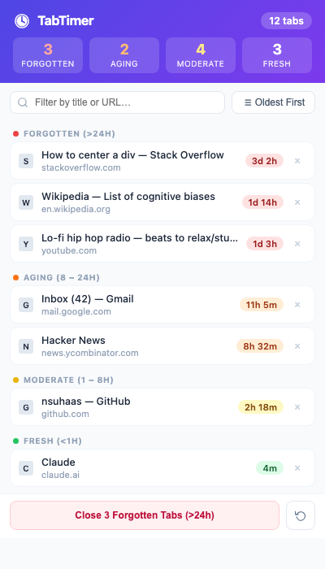
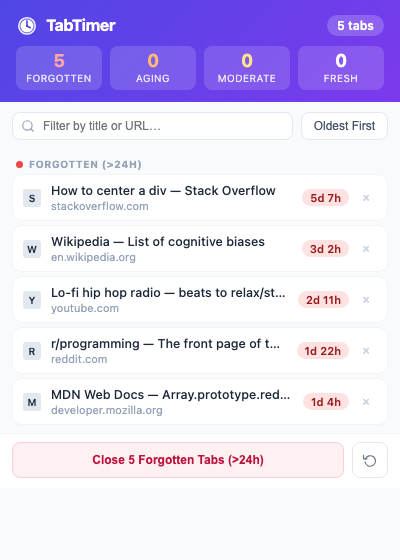
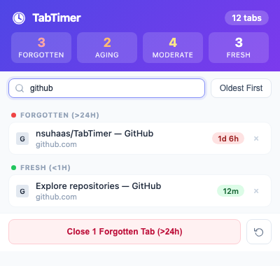

# TabTimer

A lightweight Chrome extension that shows how long each browser tab has been open — so you can finally close the ones you forgot about. Now with AI-powered tab grouping by topic.



---

## Features

- **Live age tracking** — every tab shows exactly how long it has been open (seconds, minutes, hours, days)
- **Color-coded badges** — instantly see which tabs are fresh, moderate, aging, or forgotten
- **Grouped sections** — tabs are organized into four categories sorted by age
- **Search & filter** — type to narrow down tabs by title or URL
- **Sort toggle** — switch between oldest-first and newest-first ordering
- **One-click switching** — click any tab row to jump straight to it
- **Close individual tabs** — hit × on any row to close that tab
- **Bulk close** — close all Forgotten tabs (>24h) with one button
- **Persistent tracking** — open times survive browser restarts
- **AI tab grouping** — analyzes your open tabs and automatically organizes them into labeled, color-coded Chrome tab groups by topic

---

## Age Categories

| Badge | Range | Meaning |
|-------|-------|---------|
| 🟢 Fresh | < 1 hour | Recently opened |
| 🟡 Moderate | 1 – 8 hours | Getting old |
| 🟠 Aging | 8 – 24 hours | Probably not needed |
| 🔴 Forgotten | > 24 hours | You forgot about this one |

---

## Screenshots

### Popup overview


### Forgotten tabs bulk close


### Search filtering


---

## Installation

1. Download or clone this repo:
   ```bash
   git clone https://github.com/nsuhaas/TabTimer.git
   ```
2. Open Chrome and go to `chrome://extensions`
3. Enable **Developer mode** (toggle in the top-right corner)
4. Click **Load unpacked**
5. Select the `TabTimer` folder
6. The TabTimer icon will appear in your toolbar

> **Note:** Open times are recorded from the moment the extension is installed. Tabs already open before installation will show time elapsed since install, not since they were originally opened.

---

## AI Tab Grouping

TabTimer uses the [Claude API](https://www.anthropic.com/claude) (by Anthropic) to analyze your open tabs and automatically sort them into labeled, color-coded Chrome tab groups.

### Setup

1. Get a free API key at [console.anthropic.com](https://console.anthropic.com/account/keys)
2. Right-click the TabTimer icon in your toolbar → **Options**
3. Paste your API key and click **Save**

### Usage

1. Open the TabTimer popup
2. Click **Group Tabs by AI Topic** at the bottom
3. Claude reads your tab titles and URLs, identifies topics, and creates Chrome tab groups automatically

Groups are created directly in Chrome — you'll see them appear as colored labels in your tab bar. The feature works across all open windows and skips internal Chrome pages.

> **Privacy:** Only tab titles and hostnames (e.g. `github.com`) are sent to the API — never full URLs with paths or query strings. Your API key is stored locally in browser storage and never leaves your device.

---

## How It Works

| File | Role |
|------|------|
| `background.js` | Service worker — records tab creation timestamps in `chrome.storage.local`, cleans up closed tabs, prunes stale entries every 5 minutes |
| `popup.js` | Loads all open tabs + stored timestamps, computes durations, renders the grouped list, handles AI grouping |
| `popup.html` | Popup UI shell |
| `popup.css` | Styling — color tokens, layout, badges, AI banner |
| `options.html/js/css` | Settings page for entering and saving the Anthropic API key |
| `icons/` | SVG icons (16 × 16, 48 × 48, 128 × 128) |

### Permissions used

| Permission | Why |
|------------|-----|
| `tabs` | Read tab titles, URLs, favicons; switch/close tabs; create tab groups |
| `storage` | Persist tab open timestamps and API key across sessions |
| `alarms` | Periodic cleanup of stale storage entries |
| `windows` | Focus the correct window when switching to a tab |
| `tabGroups` | Create and label Chrome tab groups |
| `host_permissions` (api.anthropic.com) | Call the Claude API for AI tab grouping |

---

## License

MIT
